# How DLSS5 reaches a 32-bit game

## Why an ordinary installer fails

A 32-bit Windows game cannot load a 64-bit DLL into its process. The NVIDIA NGX/NR components and the neural consumer in this stack are 64-bit. Renaming a DLL or changing the installer's architecture check does not solve that mismatch.

The workaround is a **separate 64-bit process**. The game keeps running as 32-bit code; the helper owns the 64-bit rendering components.

## The rendering path

```mermaid
flowchart LR
    subgraph Game["32-bit game process"]
        A["Game renders its frame"]
        B["32-bit ReShade exposes color and depth"]
        C["LumeniteFX estimates motion"]
        D["DLSS5 Feed prepares guide textures"]
        A --> B --> C --> D
    end
    subgraph Helper["Separate 64-bit helper"]
        E["D3D12 device and private DLAA request"]
        F["RenoDX consumer invokes DLSS 5 NR"]
        G["Processed output texture"]
        E --> F --> G
    end
    D -->|"Shared GPU textures and synchronization"| E
    G -->|"Result returned to the game"| H["Game presents the processed image"]
```

1. **The game renders normally.** Its executable and content are unchanged.
2. **ReShade hooks the graphics API.** Its x86 proxy and Feeder add-on load into the x86 game. ReShade exposes the color/depth resources available to effects.
3. **LumeniteFX estimates optical flow.** Most target games do not provide usable engine motion vectors to this mod. Motion estimates and confidence are prepared from rendered images.
4. **The Feeder builds the missing DLSS input.** Its shader prepares the color/depth/motion contract that a native DLSS integration would otherwise provide.
5. **The 64-bit helper receives shared resources.** Feeder coordinates the processes through IPC and shared GPU resources. On the D3D11 path, shared textures and GPU fences support the handoff; IPC carries commands/metadata rather than copying each frame through CPU memory.
6. **The helper drives NGX on D3D12.** It creates a private DLAA feature. The RenoDX consumer intercepts that evaluate and invokes the DLSS NR feature (feature 18) using the original NVIDIA runtime.
7. **The output is presented back in the game.** With pipelined handoff enabled, the game can display the prior completed output while the helper processes newer input. This adds a frame of latency to the processed output.

The DirectX 10 path uses different synchronization because D3D10 has no D3D11-style fences. Do not assume its performance will equal D3D11; it has not been tested locally in this project.

## Who implemented what

[DLSS5-Feeder](https://github.com/jlrouzies-fr/DLSS5-Feeder) implements the x86 add-on, guide shader, IPC/shared-resource bridge, 64-bit helper, and host-panel casting. The matched client/helper pair is essential.

This toolkit automates assembly of those upstream pieces, validates the executable's architecture and import hints, checks locked downloads, stages the payload outside the game, and provides reversible activation and local evidence collection. ReShade performs injection; LumeniteFX provides optical flow; the consumer and NVIDIA runtime perform neural rendering.

## Why there are two ReShade copies

| In the game directory | In `host64` |
| --- | --- |
| x86 `dxgi.dll` | x64 `dxgi.dll` |
| `dlss5-feed.addon32` | `dlss5-feed-host64.exe` |
| Guide shader and motion provider | `renodx-dlss5.addon64` |
| Game-side ReShade configuration | `nvngx_dlss.dll`, `nvngx_dlssnr.dll` |
| No 64-bit neural runtime loaded into the game | Own ReShade configuration and neural panel |

Both clients stay on their own architecture. The data crosses the process boundary; the 64-bit machine code does not.

## What it cannot promise

- It does not recover engine motion vectors, exposure, jitter, or a perfect HUD mask from arbitrary games.
- Optical flow can misinterpret fire, flashing lights, particles, disocclusions, weapon animation, and fast turns.
- A menu can process successfully while gameplay depth is unavailable. MSAA can prevent access to the useful depth buffer.
- It does not make a 32-bit game 64-bit, add engine ray tracing, or add frame generation.
- Lowering work resolution reduces the extra neural work. It does not reduce the resolution at which the original game already rendered.
- Architecture/API eligibility is an installation check, not a compatibility guarantee.

The host test proves that a synthetic input works with the local runtime/consumer/driver combination. Real gameplay still needs depth, motion, A/B, and stability checks.
